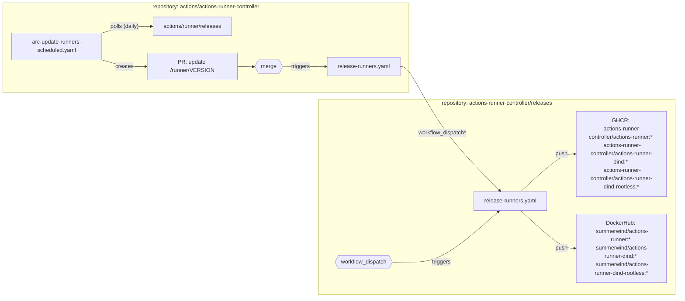
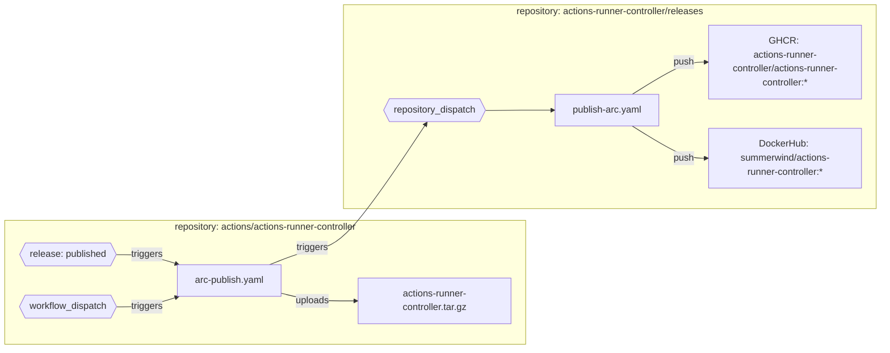
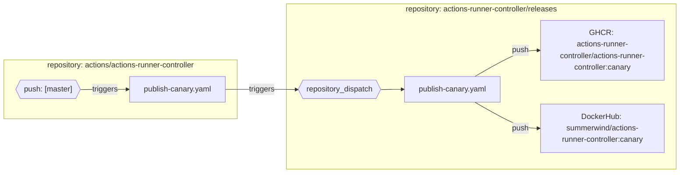

# releases

This repository contains the workflows needed to release new runner images whenever a new version of the runner binaries are released. The images will be pushed to DockerHub and GHCR.

The main reason why these workflows were extracted is that pushing container images to GHRC with GitHub App authentication is not possible at the moment.

## Usage

### Release new runner images (release-runners.yaml)



You can trigger the workflow from the CLI using the following command:

```bash
gh workflow run release-runners.yaml -R actions-runner-controller/releases \
    -f runner_version=2.300.2 \
    -f docker_version=20.10.12 \
    -f runner_container_hooks_version=0.2.0 \
    -f sha='3acef9e2863a2585142a566e78e5840b9cd22d9a' \
    -f push_to_registries=true
```

<!-- Table of Paramters -->
| Parameter                        | Description                                                                                                                                                                                                                         | Default       |
|----------------------------------|-------------------------------------------------------------------------------------------------------------------------------------------------------------------------------------------------------------------------------------|---------------|
| `runner_version`                 | The version of the [actions/runner](https://github.com/actions/runner) to use                                                                                                                                                       | `2.300.2`     |
| `docker_version`                 | The version of docker to use                                                                                                                                                                                                        | `20.10.12`    |
| `runner_container_hooks_version` | The version of [actions/runner-container-hooks](https://github.com/actions/runner-container-hooks) to use                                                                                                                           | `0.2.0`       |
| `sha`                            | The commit sha from [actions/actions-runner-controller](https://github.com/actions/actions-runner-controller) to be used to build the runner images. This will be provided to `actions/checkout` & used to tag the container images | Empty string. |
| `push_to_registries`             | Whether to push the images to the registries. Use false to test the build                                                                                                                                                           | false         |

### Publish (arc) controller images (publish-arc.yaml)



This workflow is triggered whenever a new release is published in [actions/actions-runner-controller](https://github.com/actions/actions-runner-controller). It will build the actions-runner-controller images and push them to DockerHub and GHCR.

```bash
jq -n '{"event_type": "arc", "client_payload": {"release_tag_name": "v0.26.0", "push_to_registries": false}}' \
    | gh api -X POST /repos/actions-runner-controller/releases/dispatches --input -
```

| Parameter | Description | Default |
| --- | --- | --- |
| release_tag_name | The controller image tag to use. This is not a git tag. | Empty string. Field required. |
| push_to_registries | Whether to push the image to the registries. Use false to test the build | false |

**NOTE:** this workflow should never be triggered manually unless `push_to_registries` is set to false. Otherwise, built images will be pushed to the registries.

### Publish canary images (publish-canary.yaml)



This workflow is triggered whenever a new commit is pushed to the `master` branch in [actions/actions-runner-controller](https://github.com/actions/actions-runner-controller). It will build the actions-runner-controller images and push them to DockerHub and GHCR.

For troubleshooting purposes you can run this workflow with:

```bash
jq -n '{"event_type": "canary", "client_payload": {"sha": "84104de74b8e9e555f530d40d8f33cc9471716f5", "push_to_registries": false}}' \
    | gh api -X POST /repos/actions-runner-controller/releases/dispatches --input -
```

<!-- Table of Paramters -->
| Parameter | Description | Default |
| --- | --- | --- |
| sha | The commit sha to be used to build the runner images. This will be provided to `actions/checkout` & used to tag the container images  | Empty string. Field required. |
| push_to_registries | Whether to push the images to the registries. Use false to test the build | false |

**NOTE:** this workflow should never be triggered manually unless `push_to_registries` is set to false.
